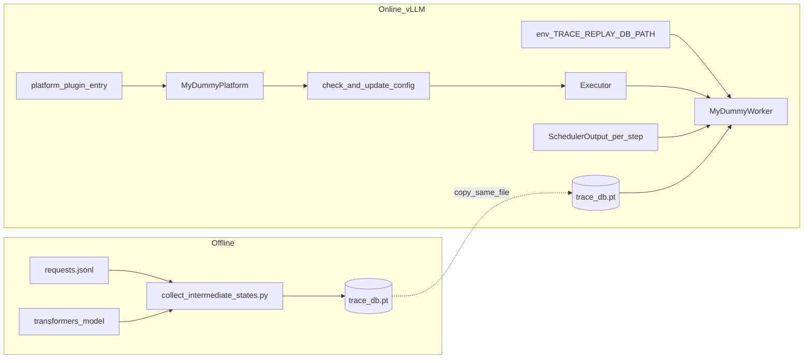

# Trace Replay：采集 Intermediate States 与在线推理操作说明及调用链

本文档说明如何使用本仓库脚本**离线采集**请求级 intermediate states（及可选 logits），以及如何配置 **vLLM + trace-replay platform plugin** 做**在线回放式推理**；并解释背后的**调用链路与数据逻辑**。

---

## 1. 文档范围与两个阶段的区别

| 阶段 | 运行环境 | 是否执行真实 Transformer 前向 | 产出 |
|------|----------|-------------------------------|------|
| **离线采集** | 本机 Python + `transformers` + PyTorch（通常 GPU） | **是**：用与线上一致的 HF 模型跑一次（或多步）前向 | `trace_db.pt`：按 `request_id` 索引的 tensor 记录 |
| **在线 replay** | vLLM 进程（加载本 plugin） | **否**：`MyDummyWorker` 不调用真实 `model.forward`，只按调度从 trace 取下一个 token | 与正常 vLLM 类似的 `RequestOutput` / API 响应；另写调度 JSONL |

**重要**：在线阶段依赖**与离线一致的模型身份**（同一 `model` id 或路径、同一词表维度），否则 tokenizer 与 trace 中的 token id 语义可能对不齐。replay worker 本身不校验权重，只按 **字符串 `request_id` + 步进游标** 查表。

---

## 2. 操作步骤 A：采集 Intermediate States

### 2.1 准备输入：JSONL

每行一个 JSON 对象，至少包含：

- `request_id`：字符串，**必须与**你在线推理时 vLLM 内部使用的请求 id **一致**（见第 7 节）。
- `prompt`：原始文本 prompt。

示例文件 `requests.jsonl`：

```json
{"request_id": "req-001", "prompt": "Tell me one short fact about pandas."}
{"request_id": "req-002", "prompt": "What is the capital of France?"}
```

### 2.2 运行采集脚本

脚本路径：[scripts/collect_intermediate_states.py](../scripts/collect_intermediate_states.py)。

```bash
cd /fact_home/lizhang/project/vllm-trace-replay-plugin

python scripts/collect_intermediate_states.py \
  --model meta-llama/Llama-3.1-8B-Instruct \
  --input-jsonl requests.jsonl \
  --output-pt artifacts/trace_db.pt \
  --dtype bfloat16 \
  --device cuda \
  --max-length 2048 \
  --num-decode-steps 8
```

参数含义简述：

- `--model`：HF 模型 id 或本地目录；需能 `AutoModelForCausalLM.from_pretrained`。
- `--num-decode-steps`：对每个 request 做**若干步自回归**：每步前向取最后一 token 的 hidden 与 logits，再把 `argmax` 得到的 token 拼回 `input_ids` 继续下一步。
- `--output-pt`：`torch.save` 的 PyTorch 文件。

### 2.3 采集脚本在做什么（逻辑）

对每条 `(request_id, prompt)`：

1. `tokenizer(..., return_tensors="pt")` 得到 `input_ids`（及可选 `attention_mask`）。
2. 循环 `num_decode_steps` 次：
   - `model(..., output_hidden_states=True, use_cache=False)`。
   - 取 **最后一层** hidden 在**序列最后一个位置**的向量：`out.hidden_states[-1][0, -1, :]`，作为该步的表征；**第一步**会写入记录的 `hidden_states`（当前实现为第一步的 last-token hidden，CPU float32 缓存）。
   - 取同位置的 `out.logits[0, -1, :]` 为 `step_logits` 中一步；`argmax` 得到 `step_token_ids` 中一步。
   - 将预测 token 追加到 `input_ids`（及 mask），模拟 decode。

3. 写入 `records[request_id] = { prompt, hidden_states, step_logits, step_token_ids }`。

4. 最外层 `payload = { "meta": {...}, "records": {...} }`，`torch.save` 到 `--output-pt`。

**说明**：这里的 *intermediate states* 在实现里具体化为 **最后一层、最后一个 token 位置的 hidden 向量**（以及每步的 logits）。若你需要「每一层全部 hidden」，需要自行改脚本增加存储维度与体积权衡。

---

## 3. 操作步骤 B（可选）：Hidden → Logits 投影

若你希望 trace 里**只强调 hidden**，再用同一模型的 `lm_head` 单独投影 logits，可使用：

[scripts/project_hidden_to_logits.py](../scripts/project_hidden_to_logits.py)

```bash
python scripts/project_hidden_to_logits.py \
  --model meta-llama/Llama-3.1-8B-Instruct \
  --input-pt artifacts/trace_db.pt \
  --output-pt artifacts/trace_db_projected.pt \
  --dtype bfloat16 \
  --device cuda
```

在线 replay worker **当前实现按 `step_token_ids`（或由 logits 推出的 token）回放**，不直接消费 hidden 做前向；hidden 主要用于离线分析或与 `lm_head` 组合生成一致的 logits/token 序列。

---

## 4. 操作步骤 C：安装 Plugin 与环境变量

### 4.1 安装

在与 **vLLM 同一 Python 环境**中 editable 安装：

```bash
cd /fact_home/lizhang/project/vllm-trace-replay-plugin
pip install -e .
```

验证 entry point 是否可见（可选）：

```bash
python -c "from importlib.metadata import entry_points; print([e.name for e in entry_points(group='vllm.platform_plugins')])"
```

应包含 `trace_replay`（见 [setup.py](../setup.py)）。

### 4.2 环境变量

| 变量 | 含义 |
|------|------|
| `TRACE_REPLAY_DB_PATH` | **必填**（worker 构造时读取）：`trace_db.pt` 的路径。 |
| `TRACE_REPLAY_REPORT_PATH` | 可选：每 step 调度 JSONL 输出路径；默认 `trace_replay_schedule_report.jsonl`。 |
| `TRACE_REPLAY_STRICT_MISSING` | `1`：trace 中不存在的 `request_id` 抛错；`0`：用 fallback token。 |
| `TRACE_REPLAY_FALLBACK_TOKEN_ID` | 缺失 trace 时使用的 token id（默认 `0`）。 |
| `VLLM_PLUGINS` | **若机器上装了多个 `vllm.platform_plugins`**，建议设为 `trace_replay`，只加载本插件，避免「多个 OOT platform 同时返回可用」导致 vLLM 报错。 |

**注意**：`TRACE_REPLAY_DB_PATH` 必须在 **worker 子进程启动前**已在环境中设置（与 vLLM 多进程模型一致）；通常你在启动 API server 或运行 `demo_run_vllm.py` 的 shell 里 `export` 即可。

---

## 5. 操作步骤 D：用 vLLM 跑在线 Replay

### 5.1 最小 Python 流程（概念）

1. 设置 `VLLM_PLUGINS`、`TRACE_REPLAY_DB_PATH`（及可选报告路径）。
2. **再** `from vllm import LLM`（或启动 API），以便 `vllm.platforms` 懒加载时能读到插件与环境。
3. 使用与离线**相同**的 `--model`（或等价 HF id），`load_format="dummy"` 可减少真实权重加载（仍会做 tokenizer 等初始化）。
4. 保证发请求的 **`request_id` 与 trace 里 key 一致**（见第 7 节）。

仓库自带端到端示例：[scripts/demo_run_vllm.py](../scripts/demo_run_vllm.py)（内置默认 trace 的 key 为 `"0"`,`"1"`,`"2"` 以匹配 `LLM.generate` 前三个内部 id）。

```bash
export VLLM_PLUGINS=trace_replay
export TRACE_REPLAY_DB_PATH=/abs/path/to/trace_db.pt
python scripts/demo_run_vllm.py --model gpt2 --max-tokens 8
```

### 5.2 OpenAI 兼容 API 服务（若你自行启动）

启动方式与官方 vLLM 相同，区别是环境变量已指向本 plugin 与 trace 文件。客户端发来的 **request id** 若可配置，应与 trace 中 key 对齐；若由服务端分配，则 trace 应按服务端规则生成（或改 worker 侧映射策略）。

---

## 6. Trace DB 文件格式（插件加载逻辑）

实现类：[trace_replay_plugin/trace_db.py](../trace_replay_plugin/trace_db.py)。

### 6.1 推荐结构（与采集脚本一致）

```python
{
  "meta": { ... },   # 可选，任意 JSON 可序列化信息
  "records": {
    "<request_id>": {
      "prompt": str,                    # 可选，仅元数据
      "hidden_states": Tensor[hidden],  # 可选
      "step_logits": [Tensor[vocab], ...],  # 可选
      "step_token_ids": [int, ...],     # 推荐：与引擎每步 consume 一致
    },
    ...
  },
}
```

### 6.2 回放时如何得到 `step_token_ids`

优先级（`_extract_step_token_ids`）：

1. 若存在 `step_token_ids` 列表 → 直接使用。
2. 否则若有 `next_token_id` 单值 → 单步 trace。
3. 否则若有 `step_logits` / `next_token_logits` / 1D logits tensor → 对每一步 `argmax` 得到 token。

### 6.3 每步消费规则（游标）

每个 `request_id` 对应内存中 `RequestTrace`：

- `cursor` 从 0 开始；每次 worker 为该 request 产出一步生成时，`next_token_id()` 读取 `step_token_ids[cursor]` 并 `cursor += 1`。
- 若 trace 用尽：返回**最后一个** trace token（重复），避免引擎崩溃；若希望严格报错可配合业务侧 `max_tokens` 与 trace 长度设计。
- 请求在 `scheduler_output.finished_req_ids` 中出现时，`finish_request` 会 **reset 游标**（便于同一 id 复用或下一轮测试）。

---

## 7. Request ID 对齐（最易踩坑）

vLLM `LLM` 高层 API 默认用内部计数器生成字符串 `"0"`, `"1"`, … 作为 `request_id`（见 vLLM `LLM._add_request`）。**Trace DB 的 `records` 顶层 key 必须与调度器里出现的 `req_id` 字符串完全一致。**

实践建议：

- **批测 / demo**：用 `demo_run_vllm.py` 的约定，或 trace 里直接写 `"0"`,`"1"`,`"2"`。
- **与真实 serving 对齐**：用你在网关或客户端注入的 **external request id**（若走 `LLMEngine.add_request(request_id, ...)` 且 id 贯通到 worker），离线采集 JSONL 的 `request_id` 必须相同。

若不一致：在 `TRACE_REPLAY_STRICT_MISSING=0` 时会一直吃到 `TRACE_REPLAY_FALLBACK_TOKEN_ID`，表现为「能跑但结果与录制不符」。

---

## 8. 调用链总览（从进程启动到每一步 replay）

### 8.1 高层数据流



### 8.2 Platform 插件如何进入 vLLM

1. **进程内首次访问** `from vllm.platforms import current_platform` 时，`vllm.platforms` 会调用 `resolve_current_platform_cls_qualname()`（见上游 vLLM 源码 `vllm/platforms/__init__.py`）。
2. 该函数通过 `importlib.metadata.entry_points(group="vllm.platform_plugins")` 加载已安装插件；对每个 entry 调用其注册函数（本仓库为 [trace_replay_plugin/__init__.py](../trace_replay_plugin/__init__.py) 中的 `trace_replay_platform_plugin()`），返回 **Platform 类的全限定名**字符串。
3. vLLM 用 `resolve_obj_by_qualname` 实例化该类，得到全局 `current_platform`（本仓库为 `MyDummyPlatform`）。

**多插件时**：若多个 OOT plugin 的注册函数都返回非 `None`，vLLM 会报错；因此推荐 **`VLLM_PLUGINS=trace_replay`**。

### 8.3 `check_and_update_config`：把「用哪个 Worker」写进配置

类：[trace_replay_plugin/my_dummy_platform.py](../trace_replay_plugin/my_dummy_platform.py)。

在 `VllmConfig` 完成解析后的平台检查阶段，vLLM 会调用 `MyDummyPlatform.check_and_update_config(vllm_config)`。本实现最关键一行：

- 若 `parallel_config.worker_cls == "auto"`，则改为  
  `"trace_replay_plugin.my_dummy_worker.MyDummyWorker"`。

这样在后续 **Executor / WorkerWrapper** 创建 worker 时，会通过 `resolve_obj_by_qualname` 加载 **你的** `WorkerBase` 子类，而不是默认 GPU/CPU worker。

同函数内还将 `async_scheduling` 置为 `False`、`compilation_config.custom_ops` 置空，以降低与 fake 执行路径的耦合。

### 8.4 Worker 生命周期（与真实推理对齐的「壳」）

vLLM v1 的 `WorkerWrapperBase.init_worker`（上游 `vllm/v1/worker/worker_base.py`）会：

1. 从 `parallel_config.worker_cls` 解析出类；
2. `worker_class(**kwargs)` 构造实例 → 进入 `MyDummyWorker.__init__`：
   - 读 `TRACE_REPLAY_DB_PATH`，`TraceDatabase.from_file` 加载全库到内存；
   - 构造 `ScheduleReporter`（JSONL 路径来自环境变量）。

随后引擎会按正常顺序 RPC / 调用：

- `init_device`
- `load_model`（本实现为空操作，不加载真实权重）
- `get_kv_cache_spec` → 返回 `{}`（无真实 KV 规格）
- `determine_available_memory` → 返回 `0`（不做显存 profiling）
- `initialize_from_config` → 记录传入的 `kv_cache_config`（replay 不分配真实 KV）

以上步骤保证 **vLLM 初始化状态机**能走完；真正「跳过算子」发生在 **`execute_model`**。

### 8.5 运行时一步：`LLMEngine.step` → `execute_model`

典型路径（概念上，具体类名随 vLLM 版本可能微调）：

1. **调度器**根据队列、显存、chunked prefill 等生成 `SchedulerOutput`（`vllm/v1/core/sched/output.py`）。
2. **Executor**（如 `UniProcExecutor`）调用各 worker 的 `execute_model(scheduler_output)`。
3. `WorkerWrapperBase.execute_model`（上游）可先处理 multimodal cache，再调用 **真实 worker**：`MyDummyWorker.execute_model`。

### 8.6 `MyDummyWorker.execute_model` 内部逻辑

实现：[trace_replay_plugin/my_dummy_worker.py](../trace_replay_plugin/my_dummy_worker.py)。

对传入的 `SchedulerOutput`：

1. **`finished_req_ids`**：对每个 id 调用 `trace_db.finish_request`，重置该 request 的游标（与「请求结束」语义对齐）。
2. **提取本步涉及的 `req_id` 列表**（顺序影响 batch 内行号，实现上合并了 `num_scheduled_tokens` 的 key 顺序与 new/cached 列表并去重）。
3. 对每个 `req_id`：`trace_db.get_next_token_id(req_id)` → 得到本步应采样的 **单个 token id**（列表形式 `[token_id]` 以符合 v1 `ModelRunnerOutput.sampled_token_ids` 形状）。
4. **`ScheduleReporter.report`**：写 logger + 追加一行 JSONL（字段含 `step_idx`、`scheduled_req_ids`、`new_req_ids`、`cached_req_ids`、`finished_req_ids`、`num_scheduled_tokens`）。
5. 返回 **`ModelRunnerOutput`**（`req_ids`、`req_id_to_index`、`sampled_token_ids` 等），交给 vLLM 后端的 **detokenizer / sampler** 等继续组装 `RequestOutput`。

**与真实 GPU worker 的差异**：真实路径会在 `GPUModelRunner` 里做大量 tensor 准备、attention、采样 logits；本路径 **跳过整个模型前向**，只提供 **已决定的 token id**，因此不占用计算卡上的 matmul/attention，但仍走 **调度与输出管线**。

### 8.7 `SchedulerOutput` 各字段在 replay 中的角色（摘要）

| 字段 | 在 replay 中的用途 |
|------|---------------------|
| `num_scheduled_tokens` | 判断本步有哪些 request 被调度；其 key 顺序用于构造 `req_ids` 列表顺序。 |
| `scheduled_new_reqs` | 提取 `new_req_ids`（报告与调试）；新请求首次进入 worker 侧缓存逻辑时 vLLM 仍会走通用路径。 |
| `scheduled_cached_reqs` | 提取 `cached_req_ids`；decode 阶段常见。 |
| `finished_req_ids` | 触发 trace 游标 reset，避免复用 id 时读到旧游标。 |

---

## 9. 与官方 `plugin_system.md` 要求的对应关系（简述）

- **`_enum` / `device_type` / `device_name`**：让 vLLM 把本环境识别为 OOT + CPU 语义设备，驱动 `DeviceConfig` 等默认值。
- **`check_and_update_config` + `worker_cls`**：把执行实体切到 `MyDummyWorker`，否则仍会用默认 worker 跑真实模型。
- **`get_attn_backend_cls` / `get_device_communicator_cls`**：满足 vLLM 在构图、分布式与 attention 选择阶段的 **类解析**；replay worker 虽不执行真实 attention，但平台层仍需返回可 import 的实现（本仓库指向 CPU attention 与 base communicator）。

---

## 10. 故障排查清单

| 现象 | 可能原因 |
|------|-----------|
| 启动报「多个 platform plugin」 | 设置 `VLLM_PLUGINS=trace_replay`，或卸载冲突插件。 |
| Worker 报缺少 `TRACE_REPLAY_DB_PATH` | 环境变量未传入 worker 子进程；检查启动脚本 / systemd / k8s env。 |
| 生成全是同一个无意义 token | trace 无此 `request_id` 且 `STRICT_MISSING=0`，走 fallback。 |
| 长请求中途错乱 | trace 中 `step_token_ids` 长度短于实际 decode 步数；加长采集 `--num-decode-steps` 或接受「末尾重复」行为。 |
| 报告文件为空 | 未触发 `execute_model`（无请求）；或路径无写权限。 |

---

## 11. 相关文件索引

| 文件 | 作用 |
|------|------|
| [setup.py](../setup.py) | `vllm.platform_plugins` entry point |
| [trace_replay_plugin/__init__.py](../trace_replay_plugin/__init__.py) | 返回 `MyDummyPlatform` FQCN |
| [trace_replay_plugin/my_dummy_platform.py](../trace_replay_plugin/my_dummy_platform.py) | Platform：改 config、attention/communicator |
| [trace_replay_plugin/my_dummy_worker.py](../trace_replay_plugin/my_dummy_worker.py) | Worker：`execute_model` 回放 |
| [trace_replay_plugin/trace_db.py](../trace_replay_plugin/trace_db.py) | 加载 trace、游标、`get_next_token_id` |
| [trace_replay_plugin/schedule_reporter.py](../trace_replay_plugin/schedule_reporter.py) | 每 step JSONL + 日志 |
| [scripts/collect_intermediate_states.py](../scripts/collect_intermediate_states.py) | 离线采集 |
| [scripts/project_hidden_to_logits.py](../scripts/project_hidden_to_logits.py) | 可选 hidden→logits |
| [scripts/demo_run_vllm.py](../scripts/demo_run_vllm.py) | 最小端到端 demo |

---

如需把「自定义 request_id 从 HTTP 层贯通到引擎」也纳入文档化流程，可以在你实际部署的 API 网关层补充一节：**客户端 header / body 中的 id 如何映射到 `EngineCoreRequest.request_id`**（取决于你使用的 vLLM 版本与 OpenAI 兼容层实现）。
